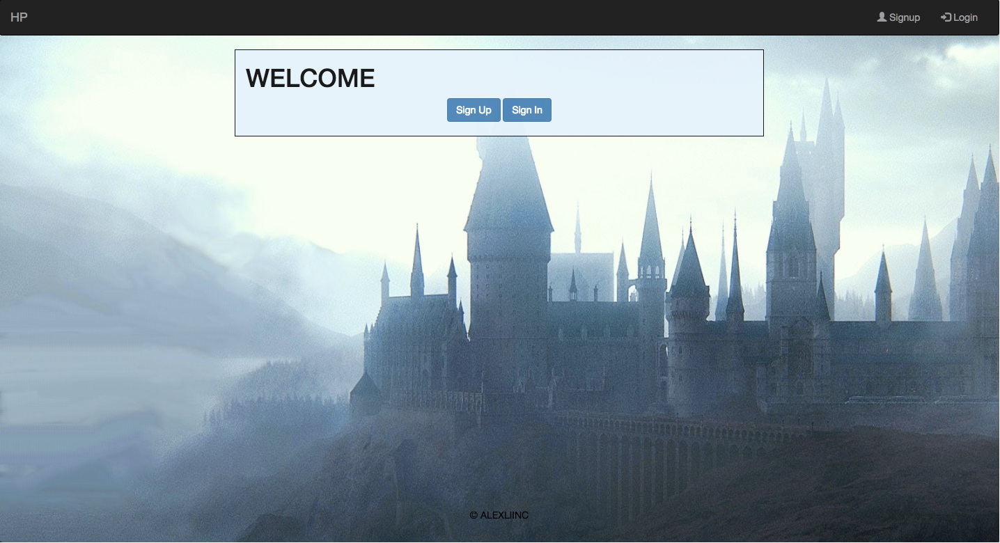

Project Name: HP KmK 
Author: Alex Li 
Developer @GA in DENVER 

<h1>WELCOME!!!</h1> 
[Link to the Project]()

<h2>Project Idea:</h2> 
User will be given a random character from Harry Potter and must decide whether to Kill Marry Or Kiss them 

<h2>TOOLS: HTML CSS JS Chart.js fullPage.JS FIREBASE JQUERY SURGE</h2> 
<h2>Why these Tools:</h2> 
Just last minute change of everything lols 

<h2>General Approach:</h2> 
Just working on a MVC of getting an API from GoT and being able to make some decision off that. Once you make a decision you can be able to edit that record as well as deleting that record. 

<h2>Installation instructions:</h2> 
nada homie 

<h2>Screenshots of app:</h2> 
 

<h2>future endeavors:</h2> 
Pulling random characters 
Saving chart to db 
Pick a new idea hahahahahahahahahahahahahahahahahaha 

Day 1: 
-created my repo  
-created [Trello](https://trello.com/b/rbAfTWhc/project-4) for everything 
-created wireframe using [Mockflow](https://wireframepro.mockflow.com/view/D4330f6f7f3a02a5856bdded065648a99) 

Day 2: 
(╯°□°）╯︵ ┻━┻ 

Day 2.5: 
┻━┻ ︵ヽ(`Д´)ﾉ︵ ┻━┻ 

Day 2.75: 
[¬º-°]¬ 

Day 3: 
乁( ◔ ౪◔)「      ┑(￣Д ￣)┍ 

Day 3.5: 
¯\(°_o)/¯ 

Day 4: 
୧༼ಠ益ಠ╭∩╮༽ 

Day 4.56: 
(ノಠ益ಠ)ノ彡┻━┻ 
-first try but gave up on this. see failures here: [github](https://github.com/alexliinc/project_4)  

Day 4.9999999999999: 
（ ^_^）o自自o（^_^ ） 

Day 5: 
┬─┬⃰͡ (ᵔᵕᵔ͜ ) 

Day 5.5: 
ᕕ( ᐛ )ᕗ 

Day NOPE: 
(•_•) ( •_•)>⌐■-■ (⌐■_■) 
